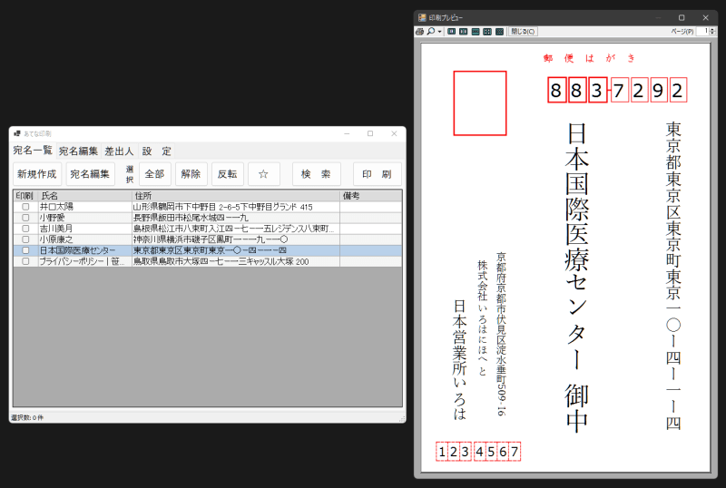
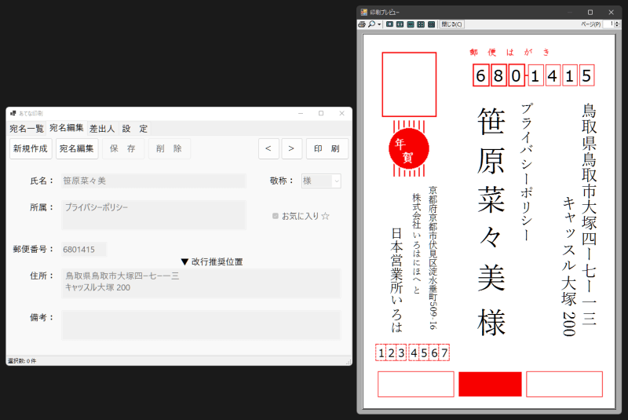

# HagakiPrint | あてな印刷

## 🤔 概要

- 年賀状、官製はがきへの宛名印刷をおこなうソフト
- 管理者権限を必要としない
- 必要最低限の機能

## 📷 スクリーンショット

## ⌨ ショートカットキー

|Key|機能|Key|機能|
|:-:|:-|:-:|:-|
|Ctrl+1|ページ切り替え（宛名一覧）|Ctrl+N|宛名新規作成|
|Ctrl+2|ページ切り替え（宛名編集）|Ctrl+E|宛名編集|
|Ctrl+3|ページ切り替え（差出人）|Escape|（宛名編集ページ）編集をキャンセル|
|Ctrl+4|ページ切り替え（設定）|Ctrl+S|（宛名編集ページ）編集を保存|
|Ctrl+P|印刷|PageDown|（宛名編集ページ）次の宛名|
|Shift+Ctrl+P|プレビュー|PageUp|（宛名編集ページ）前の宛名|

## ⚠ 注意

- 印刷プレビューから印刷するとはがきの背景画像も印刷されてしまいます。プレビューにのみ使用してください。

## :package: 関連

- [LiteDB](https://github.com/mbdavid/LiteDB)
